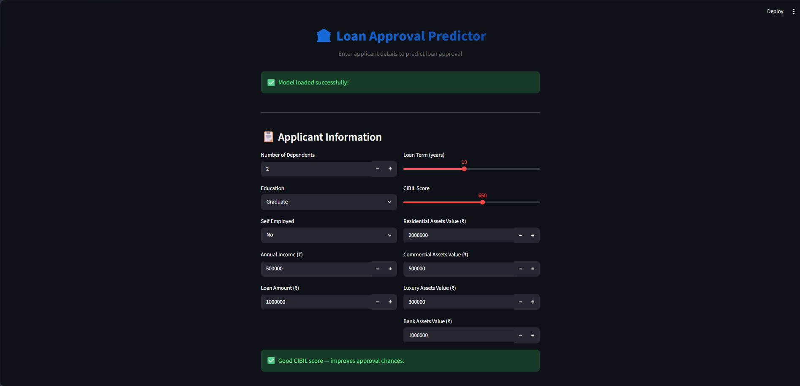
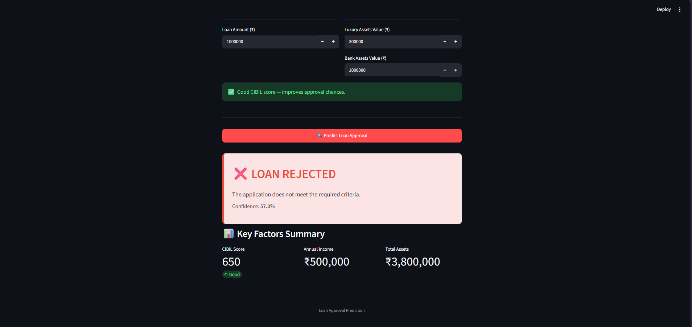

# 🏦 Loan Approval Prediction Using Machine Learning

📌 Overview
This project builds an end-to-end Machine Learning pipeline to predict whether a loan application will be Approved or Rejected. It covers the full data science workflow — from exploratory analysis to model deployment — using real-world style banking data.

---

## 🏗️ Architecture

```
Raw Dataset → EDA & Preprocessing → Model Training → Evaluation → Streamlit App
```

---

## 🔄 End-to-End Workflow

### 🔹 1. Dataset Understanding
- Loaded and inspected the dataset using Pandas
- Identified numerical and categorical features
- Checked shape, data types, and missing values
- Generated statistical summaries

### 🔹 2. Exploratory Data Analysis (EDA)

**Univariate Analysis**
- Loan Status Distribution
- Annual Income Distribution
- CIBIL Score Distribution
- Loan Amount, Term, and Education breakdowns

**Bivariate Analysis**
- Income vs Loan Status
- CIBIL Score vs Loan Status
- Education, Employment, Assets vs Loan Status

**Multivariate Analysis**
- Correlation Heatmap
- Pair Plot across selected features

### 🔹 3. Data Preprocessing
- Removed non-informative ID columns
- Label encoded categorical variables
- Checked and removed duplicate records
- Applied StandardScaler for distance-based models
- Split data: **80% Training / 20% Testing** (stratified)

### 🔹 4. Model Building

Built and trained **5 classification models**:

| Model | Type |
|---|---|
| Logistic Regression | Linear |
| Decision Tree | Tree-based |
| Random Forest | Ensemble |
| XGBoost | Gradient Boosting |
| KNN | Distance-based |

### 🔹 5. Model Evaluation

Compared all models using:
- Accuracy Score
- Confusion Matrix
- Precision, Recall, F1-Score

### 🔹 6. Feature Importance Analysis
- Identified top features driving predictions
- Visualized using Random Forest and XGBoost importance scores

### 🔹 7. Streamlit Web App *(Bonus)*
- Interactive UI to enter applicant details
- Returns instant loan approval prediction with confidence score

---

## 📸 App Screenshots

### 🖥️ Application Interface


### ✅ Prediction in Action


---

## 📈 Key Insights

- **CIBIL Score** is the strongest predictor of loan approval
- Higher **annual income** significantly improves approval chances
- **Assets** (residential, commercial, bank) act as collateral indicators
- **Ensemble models** (Random Forest, XGBoost) outperformed single classifiers
- Education and employment status have a secondary but measurable influence

---

## 🚀 Tech Stack

- **Language:** Python 3.10+
- **Data:** Pandas, NumPy
- **Visualization:** Matplotlib, Seaborn
- **Machine Learning:** Scikit-learn, XGBoost
- **Web App:** Streamlit
- **Model Saving:** Joblib

---

## 📁 Project Structure

```
loan-approval-prediction/
│
├── README.md
│
├── notebook/
│   └── loan_approval_prediction.ipynb
│
├── data/
│   └── loan_approval_dataset.csv
│
├── models/
│   ├── best_model.pkl
│   ├── scaler.pkl
│   ├── label_maps.pkl
│   └── feature_names.pkl
│
├── app/
│   └── streamlit_app.py
│
├── images/
│   ├── app_interface.png
│   └── prediction_result.png
│
├── report/
│   └── project_report.md
│
└── requirements.txt
```

---

## ⚡ Getting Started

**1. Clone the repository**
```bash
git clone https://github.com/rider-04/loan-approval-prediction.git
cd loan-approval-prediction
```

**2. Install dependencies**
```bash
pip install -r requirements.txt
```

**3. Add the dataset**
- Place `loan_approval_dataset.csv` inside the `data/` folder

**4. Run the Jupyter Notebook**
```bash
jupyter notebook notebook/loan_approval_prediction.ipynb
```

**5. Launch the Streamlit App**
```bash
python -m streamlit run app/streamlit_app.py
```

---

## 💡 Key Learnings

- Performing structured EDA to uncover patterns before modeling
- Handling categorical encoding and feature scaling correctly
- Comparing multiple ML models using standardized metrics
- Understanding feature importance for model explainability
- Building an interactive prediction app with Streamlit

---

## 🚀 Future Improvements

- Hyperparameter tuning using GridSearchCV
- Handle class imbalance using SMOTE
- Deploy the Streamlit app to Streamlit Cloud
- Add SHAP values for deeper model explainability
- Experiment with Neural Networks for comparison

---

## 👤 Author

**Parth Sharma**

⭐ If you found this project useful, consider giving it a star!